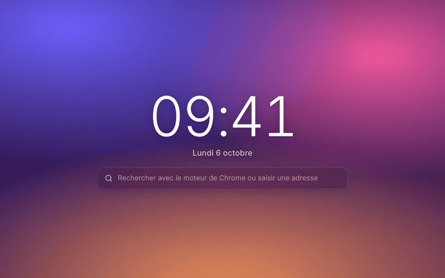
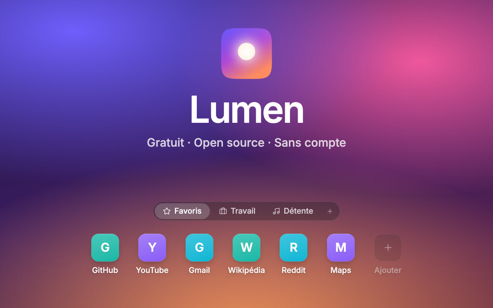
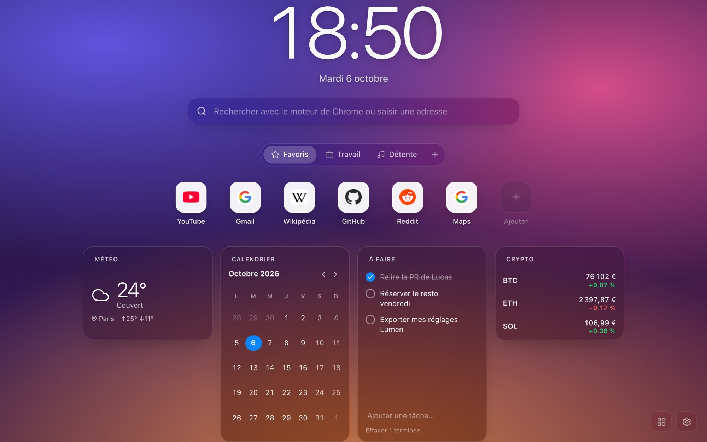
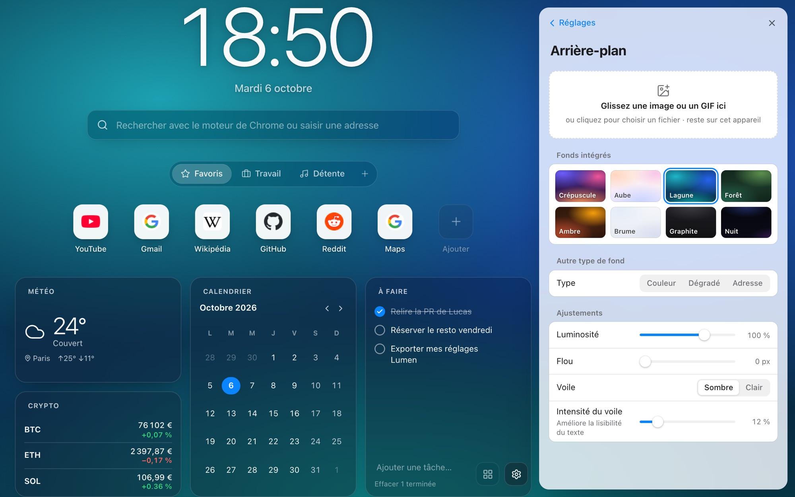
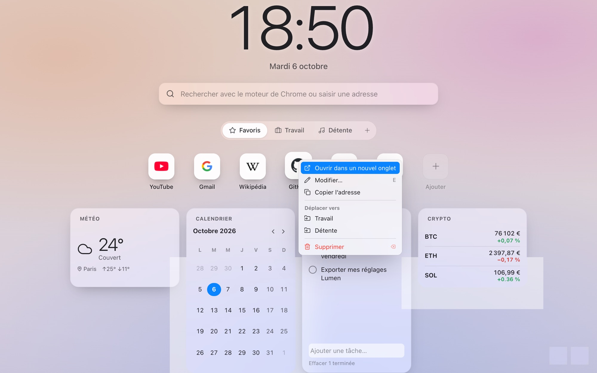

# Lumen

Lumen remplace la page Nouvel onglet de Chrome. On y trouve l'heure, une barre de recherche et vos sites rangés en groupes, sur le fond de votre choix. Tout tourne dans le navigateur : pas de compte, pas de serveur, pas de pistage.

<p align="center">
  
</p>

<p align="center"><a href="docs/media/lumen-promo.mp4">▶ Voir la vidéo de 40 secondes</a> (avec le son)</p>

[English version](README.md)

L'idée vient de GNTD, dont je n'aimais pas l'interface, alors j'ai écrit la mienne. Je voulais une page qui ait l'air finie dès l'installation et qui se fasse oublier ensuite, avec tous les réglages à portée de main pour qui les cherche.

## Ce que fait Lumen

- Les raccourcis sont rangés dans des groupes (Travail, Musique, ce que vous voulez), affichés en onglets ou tous à la fois. On glisse un raccourci pour le déplacer, ou on le lâche sur l'onglet d'un autre groupe pour l'y ranger. Si on s'attarde une demi-seconde sur un onglet pendant le glisser, il s'ouvre.
- Une image ou un GIF déposé n'importe où sur la page devient le fond. Lumen mesure la luminosité de l'image et passe le texte en clair ou en foncé pour qu'il reste lisible.
- Vous pouvez importer des dossiers de vos favoris Chrome. Chaque dossier devient un groupe.
- La recherche utilise le moteur choisi dans Chrome. Si vous tapez le nom d'un de vos raccourcis, il apparaît en suggestion, et cette recherche-là ne sort pas de votre machine.
- Réglages, groupes et widgets se synchronisent entre vos ordinateurs via Chrome Sync. Les images, les notes et les tâches restent sur l'ordinateur où vous les avez créées.
- Douze widgets facultatifs : météo, calendrier, tâches, notes, minuteur et Pomodoro, horloges du monde, RSS, crypto, bourse, GitHub, Spotify et un widget personnalisé. Aucun ne se charge tant que vous ne l'avez pas ajouté.
- Tout fonctionne hors ligne, sauf les widgets qui vont chercher des données sur Internet.

## Vidéo

<a href="docs/media/lumen-promo.mp4"></a>

Quarante secondes, avec le son : recherche, groupes, glisser-déposer, une image déposée qui devient le fond, widgets et réglages.

| Widgets | Réglages |
| --- | --- |
|  |  |



## Installation

Lumen n'est pas encore sur le Chrome Web Store, il faut donc le charger à la main. Ça prend une minute.

1. Téléchargez `lumen-x.y.z.zip` dans la dernière [release](../../releases) et décompressez-le dans un dossier que vous garderez.
2. Ouvrez `chrome://extensions` et activez le mode développeur (en haut à droite).
3. Cliquez sur « Charger l'extension non empaquetée » et choisissez ce dossier.
4. Ouvrez un nouvel onglet. Chrome demande s'il faut garder la page modifiée : gardez-la.

Pour mettre à jour, décompressez la nouvelle version dans le même dossier et cliquez sur la flèche de rechargement de la carte Lumen. Chrome reconnaît une extension non empaquetée à son dossier : un autre dossier, et c'est une installation neuve avec des réglages vides.

## Comment c'est construit

Preact 11 avec les signals, TypeScript et Vite 8. Trois dépendances à l'exécution (`preact`, `@preact/signals`, `lucide-preact`). Le code chargé à chaque nouvel onglet pèse environ 41 Ko compressé ; les réglages, les éditeurs et chaque widget arrivent à part, au moment où on en a besoin. Dans mes tests, la page atteint son événement `load` en 80 ms environ.

On ouvre un nouvel onglet des dizaines de fois par jour, alors l'essentiel du travail a porté sur la vitesse et sur une règle : ne jamais perdre la configuration de quelqu'un.

Chrome Sync accepte 8 Ko par élément stocké et environ 100 Ko au total, et quelques centaines de raccourcis ne tiennent pas dans un seul élément. Lumen sérialise toute la configuration, la découpe en morceaux, ne réécrit que ceux qui ont changé et écrit l'index en dernier. Un appareil qui lit pendant une écriture vérifie un hash et garde sa propre copie si les morceaux ne correspondent pas.

Pour éviter un flash blanc, le premier affichage lit une copie de la configuration dans `localStorage`, qui est synchrone. Le vrai stockage est lu juste après, et le plus récent des deux l'emporte. Une miniature floue de 2 Ko de votre image de fond s'affiche le temps que l'image complète sorte d'IndexedDB.

J'ai écrit le glisser-déposer moi-même, sur les Pointer Events. L'API de drag HTML5 ne sait ni animer les éléments voisins ni déposer sur un onglet, et je voulais les deux. Les autres éléments glissent à leur nouvelle place avec des animations FLIP, et Échap annule.

Manifest V3 interdit `eval` et le code distant, ce qui exclut les scripts utilisateur. Les widgets personnalisés sont donc des définitions JSON : un texte, une iframe isolée, ou des valeurs tirées d'une API JSON par leur chemin.

Les intégrations se passent de serveur. Spotify passe par OAuth avec PKCE via `chrome.identity`, sans client secret. GitHub utilise un jeton personnel qui reste sur votre machine. Météo, crypto et bourse appellent des API publiques qui acceptent les requêtes d'autres origines.

À l'installation, Lumen demande trois permissions (`storage`, `favicon`, `search`), et aucune n'affiche d'avertissement. L'accès aux favoris et la connexion Spotify sont demandés quand vous cliquez sur le bouton qui en a besoin.

Le format des données est versionné, avec une liste de migrations. Tout ce qui vient du stockage, d'un autre appareil ou d'un fichier importé passe par un validateur qui borne les nombres, ignore les champs inconnus et refuse les URL `javascript:`. Une configuration abîmée donne les réglages par défaut, pas une page blanche.

66 tests unitaires (Vitest) couvrent le découpage pour la synchro, les migrations, le store, l'ordre du glisser-déposer, la lecture des widgets et l'import/export. Le script de build contrôle aussi le manifeste, les permissions et la politique de sécurité du contenu, et échoue au moindre écart. GitHub Actions lance le tout à chaque push et à chaque pull request.

Pour les détails : [docs/ARCHITECTURE.md](docs/ARCHITECTURE.md) décrit les couches de stockage, la mise en page et le contrat des widgets, et [docs/INTEGRATIONS.md](docs/INTEGRATIONS.md) indique ce que chaque widget envoie, et à qui.

## Développement

Il faut Node 20 ou plus récent.

```bash
npm install
npm run dev       # l'interface dans un onglet normal, stockage simulé par localStorage
npm test
npm run build     # typecheck, build dans dist/, vérification Manifest V3
npm run package   # build + release/lumen-x.y.z.zip
```

Chargez `dist/` avec « Charger l'extension non empaquetée » pour essayer vos changements dans Chrome. [CONTRIBUTING.md](CONTRIBUTING.md) explique comment proposer une modification.

```
src/
  app/          mise en page, variables du thème, raccourcis clavier
  features/     horloge, recherche, raccourcis, fond, réglages, présentation
  widgets/      contrat des widgets, registre et les douze widgets
  storage/      schéma et migrations, découpage pour la synchro, IndexedDB, import/export
  state/        store (signals) et données locales des widgets
  lib/          glisser-déposer, FLIP, URL, favicons, cache réseau
  components/   modale, menu contextuel, contrôles de formulaire, icônes
```

## Licence

[MIT](LICENSE)
