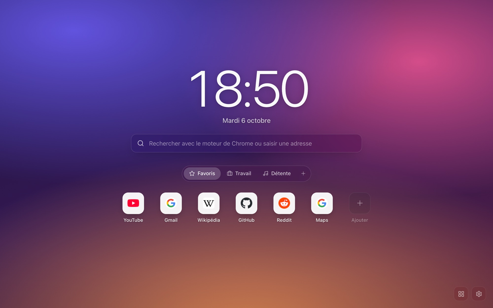

# Lumen

Lumen replaces Chrome's new tab page with the time, a search box and your sites sorted into groups, on top of any background you like. Everything runs in the browser. There's no account, no server and no tracking.



[Version française](README.fr.md)

GNTD gave me the idea, but I didn't like its interface, so I wrote my own. I wanted a page that looks finished the moment you install it and stays out of the way afterwards, with every setting there if you go looking for it.

## What it does

- Your shortcuts live in groups (Work, Music, whatever you want), shown as tabs or all at once. Drag a shortcut to reorder it, or drop it on another group's tab to move it there. If you hover a tab for half a second while dragging, it opens.
- Drop an image or a GIF anywhere on the page and it becomes the background. Lumen measures how bright the image is and switches the text between light and dark so it stays readable.
- You can import folders from your Chrome bookmarks. Each folder becomes a group.
- The search box uses the engine you picked in Chrome. If you type the name of one of your shortcuts, it shows up as a suggestion, and that lookup never leaves your machine.
- Settings, groups and widgets sync between your computers through Chrome Sync. Images, notes and to-dos stay on the computer where you created them.
- There are twelve optional widgets: weather, calendar, to-do list, notes, timer and Pomodoro, world clocks, RSS, crypto prices, stocks, GitHub, Spotify, and a custom one. None of them loads until you add it.
- Everything except the network widgets works offline.

The interface is in French for now.

| Widgets | Settings |
| --- | --- |
|  |  |


## Install

Lumen isn't on the Chrome Web Store yet, so you load it by hand. It takes a minute.

1. Download `lumen-x.y.z.zip` from the latest [release](../../releases) and unzip it into a folder you'll keep.
2. Open `chrome://extensions` and turn on Developer mode (top right).
3. Click "Load unpacked" and pick that folder.
4. Open a new tab. Chrome asks whether to keep the changed page: keep it.

To update, unzip the new version into the same folder and click the reload arrow on Lumen's card. Chrome identifies an unpacked extension by its folder, so a different folder means a fresh install with empty settings.

## How it's built

Preact 11 with signals, TypeScript and Vite 8. There are three runtime dependencies (`preact`, `@preact/signals`, `lucide-preact`). The code that loads on every new tab weighs about 41 KB gzipped, and the settings, editors and each widget load separately when you need them. In my tests the page reaches its load event in about 80 ms.

A new tab page gets opened dozens of times a day, so most of the work went into making it fast and making sure it can't lose your setup.

Chrome Sync allows 8 KB per stored item and about 100 KB in total, and a few hundred shortcuts don't fit in one item. Lumen serializes the whole configuration, cuts it into chunks, rewrites only the chunks that changed, and writes the index last. A device that reads during a write checks a hash and keeps its own copy if the chunks don't match.

To avoid a blank flash, the first render reads a copy of your setup from `localStorage`, which is synchronous. The real storage is read right after and the newer of the two wins. A blurred 2 KB thumbnail of your background image shows until the full image comes out of IndexedDB.

I wrote the drag and drop myself on top of pointer events. The HTML5 drag API can't animate the neighbouring items or drop onto a tab, and I wanted both. The other items slide into place with FLIP animations, and Escape cancels a drag.

Manifest V3 forbids `eval` and remote code, which rules out user scripts. Custom widgets are JSON definitions instead: some text, a sandboxed iframe, or values pulled from a JSON API by path.

The integrations work without a backend. Spotify uses OAuth with PKCE through `chrome.identity`, so no client secret is involved. GitHub uses a personal token that stays on your machine. Weather, crypto and stocks call public APIs that allow cross-origin requests.

Lumen asks for three permissions at install (`storage`, `favicon`, `search`), and none of them triggers a warning. Bookmark access and the Spotify login are requested when you click the button that needs them.

The data format is versioned with a migration list. Anything read from storage, from another device or from an imported file goes through a validator that clamps numbers, drops unknown fields and rejects `javascript:` URLs. A broken config falls back to defaults instead of a blank page.

There are 66 unit tests (Vitest), covering the sync chunking, migrations, the store, drag-and-drop ordering, widget parsing and import/export. The build script also checks the manifest, the permissions and the content security policy, and fails if any of them drifts. GitHub Actions runs both on every push and pull request.

If you want the details, [docs/ARCHITECTURE.md](docs/ARCHITECTURE.md) covers the storage layers, the layout system and the widget contract, and [docs/INTEGRATIONS.md](docs/INTEGRATIONS.md) explains what each widget sends and to whom. Both are in French.

## Development

You need Node 20 or later.

```bash
npm install
npm run dev       # UI in a normal browser tab, storage simulated with localStorage
npm test
npm run build     # typecheck, build to dist/, check MV3 compliance
npm run package   # build + release/lumen-x.y.z.zip
```

Load `dist/` with "Load unpacked" to try your changes in Chrome. [CONTRIBUTING.md](CONTRIBUTING.md) (in French) explains how to send a change.

```
src/
  app/          page layout, theme variables, keyboard shortcuts
  features/     clock, search, shortcuts, background, settings, onboarding
  widgets/      widget contract, registry and the twelve widgets
  storage/      schema and migrations, sync chunking, IndexedDB, import/export
  state/        signals store and per-widget local data
  lib/          drag and drop, FLIP, URLs, favicons, network cache
  components/   modal, context menu, form controls, icons
```

## License

[MIT](LICENSE)
